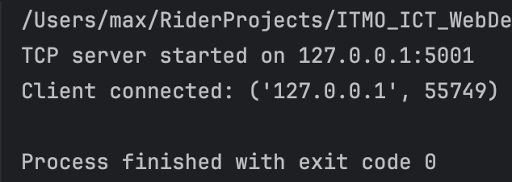
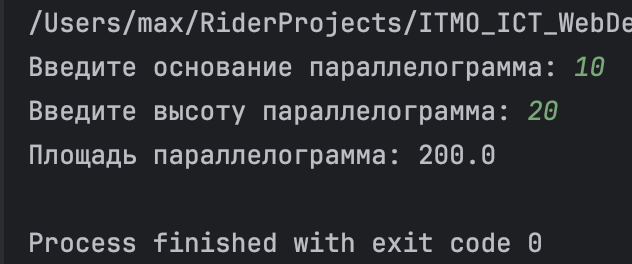
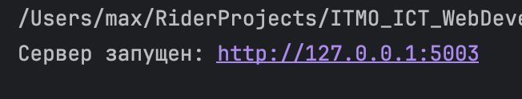
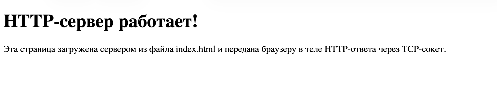
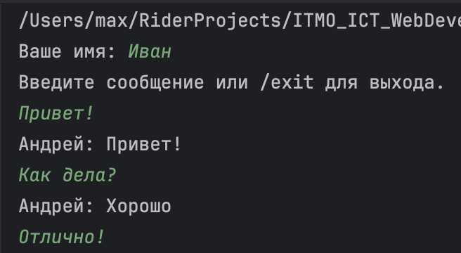
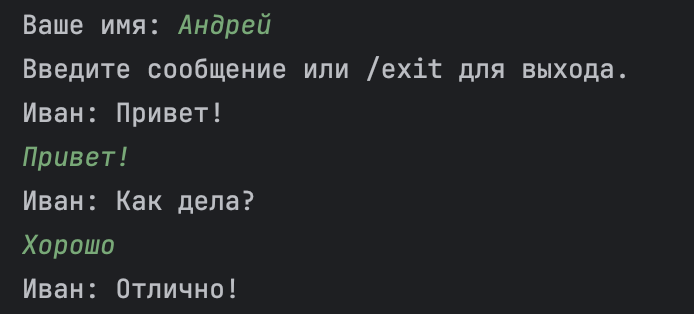
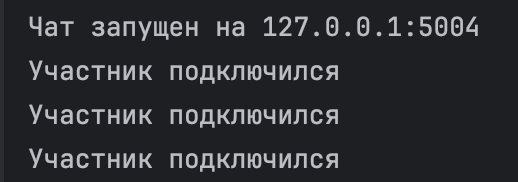
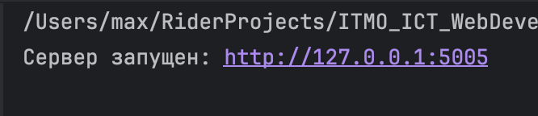
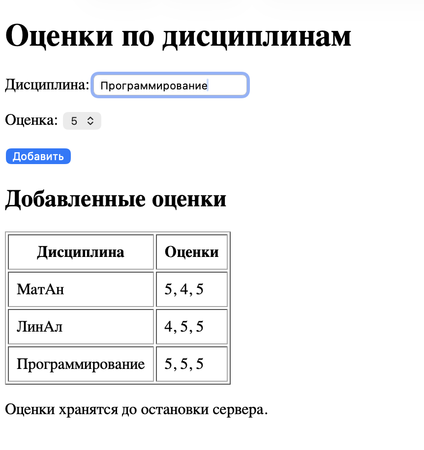

# Отчет по лабораторной работе №1

**Тема:** Работа с сокетами  
**Выполнил:** Криличевский Максим, K3339

## Практическое задание 1. Обмен сообщениями по UDP

**Цель:** организовать обмен сообщениями между клиентом и сервером с помощью библиотеки `socket` и протокола UDP.

**Реализация:** сервер ожидает данные на `127.0.0.1:5000`. Клиент отправляет `Hello, server`, сервер отвечает `Hello, client!`. Для передачи и получения датаграмм используются `sendto()` и `recvfrom()`.

**Результат:** двусторонний обмен выполнен успешно.

### Запуск сервера:

### Запуск клиента:

### Ответ сервера:

## Практическое задание 2. Вычисление площади параллелограмма по TCP

**Цель:** передать серверу основание и высоту параллелограмма и получить вычисленную площадь.

**Реализация:** клиент подключается к `127.0.0.1:5001` по TCP и отправляет введённые числа. Сервер вычисляет `S = a * h` и возвращает результат. После одного обмена программы закрывают соединение.

**Результат:** при основании `10` и высоте `20` клиент получил площадь `200`. Сервер и клиент завершились без ошибок.

### Консоль сервера:

### Консоль клиента:

## Практическое задание 3. HTTP-сервер для передачи HTML-страницы

**Цель:** отправить браузеру HTML-страницу из файла `index.html` с помощью библиотеки `socket`.

**Реализация:** TCP-сервер работает на `127.0.0.1:5003`. Он читает HTML-файл и отправляет HTTP-ответ со статусом `200 OK`, заголовками `Content-Type`, `Content-Length`, `Connection` и содержимым страницы. Таймаут в две секунды позволяет закрывать подключения, которые не отправляют запрос.

**Результат:** браузер отобразил страницу «HTTP-сервер работает!». Проверка подтвердила совпадение тела ответа с файлом `index.html`.

### Запуск сервера:

### Страница в браузере:

## Практическое задание 4. Многопользовательский чат по TCP

**Цель:** реализовать чат для нескольких участников с использованием `socket` и `threading`.

**Реализация:** сервер на `127.0.0.1:5004` хранит список подключённых клиентов и обрабатывает каждого в отдельном потоке. Клиент отправляет сообщения, сервер пересылает их остальным участникам. На клиенте ввод и получение сообщений выполняются в разных потоках. `Lock` защищает список клиентов и рассылку, а символ `\n` отделяет сообщения друг от друга. Команда `/exit` закрывает соединение. Потоки запускаются через `Thread.start()`.

**Результат:** проверен обмен сообщениями между тремя клиентами, включая русский текст и длинные сообщения. После обычного выхода и внезапного отключения участника чат продолжает работать. При остановке сервера клиент сообщает о потере связи.

**Примеры работы**

### Первый клиент

### Второй клиент

### На сервере

## Практическое задание 5. Обработка GET- и POST-запросов

**Цель:** реализовать веб-сервер на библиотеке `socket`, который принимает дисциплину и оценку и показывает добавленные записи.

**Реализация:** сервер на `127.0.0.1:5005` оформлен классом `MyHTTPServer`. Методы отдельно отвечают за приём соединения, разбор запроса и заголовков, обработку и отправку ответа. GET возвращает HTML-страницу с формой и таблицей оценок. POST получает название дисциплины и оценку от 2 до 5, проверяет поля и добавляет оценку в список выбранной дисциплины. Каждая дисциплина отображается одной строкой, а её оценки — через запятую. После сохранения сервер перенаправляет браузер на GET, чтобы обновление страницы не дублировало запись. Данные хранятся в памяти до остановки сервера.

**Результат:** повторные POST-запросы для «МатАн» с оценками 5, 4 и 5 сформировали одну строку «МатАн — 5, 4, 5». Другая дисциплина отображается отдельно. Повторный GET не добавляет оценок. Пустая дисциплина и оценка вне диапазона отклоняются с ответом `400 Bad Request`.

**Пример работы**

### Старт сервера

### Интерфейс веб-сервера

## Вывод

В ходе лабораторной работы были изучены основные принципы сетевого взаимодействия с использованием сокетов: передача датаграмм по UDP, установление TCP-соединения, многопоточная обработка клиентов и структура HTTP-запросов и ответов. Были реализованы UDP- и TCP-клиент-серверные приложения, HTTP-сервер, многопользовательский чат и обработка GET- и POST-запросов.