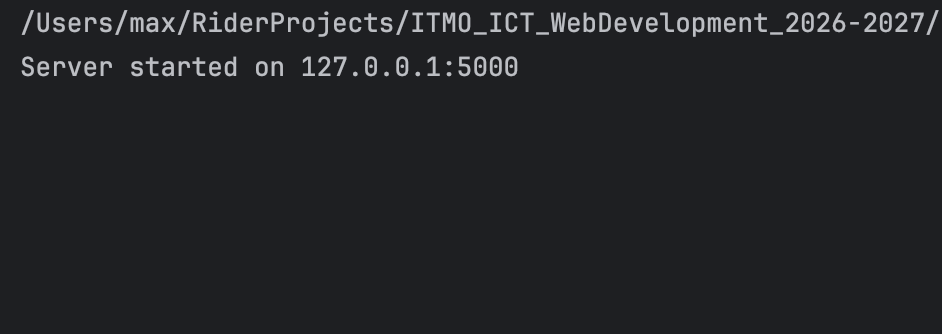
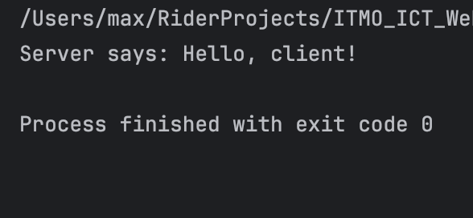
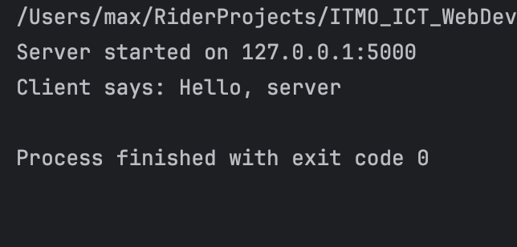

# Отчет по лабораторной работе №1
## Тема: "Работа с сокетами"
## Выполнил: Криличевский Максим K3339
## Практическое задание 1. Обмен сообщениями по UDP

### Цель

Реализовать клиент-серверное взаимодействие с использованием протокола UDP и библиотеки `socket`.
Клиент должен отправлять серверу сообщение `Hello, server`, после чего сервер выводить полученное сообщение и отправлять клиенту ответ `Hello, client!`.

### Сервер

```python
import socket

HOST = "127.0.0.1"
PORT = 5000

server_socket = socket.socket(socket.AF_INET, socket.SOCK_DGRAM)
server_socket.bind((HOST, PORT))

print(f"Server started on {HOST}:{PORT}")

data, client_address = server_socket.recvfrom(1024)
message = data.decode()

print(f"Client says: {message}")

response = "Hello, client!"
server_socket.sendto(response.encode(), client_address)
server_socket.close()
```

### Клиент

```python
import socket

HOST = "127.0.0.1"
PORT = 5000

client_socket = socket.socket(socket.AF_INET, socket.SOCK_DGRAM)
message = "Hello, server"
client_socket.sendto(message.encode(), (HOST, PORT))
data, server_address = client_socket.recvfrom(1024)

print(f"Server says: {data.decode()}")

client_socket.close()
```

### Результат работы!

После запуска сервера он начинает ожидать UDP-датаграмму на адресе `127.0.0.1:5000`.

При запуске клиента сервер получает сообщение:



Клиент получает ответ сервера:



Таким образом, был реализован двусторонний обмен сообщениями между клиентом и сервером по протоколу UDP.

### Вывод по первому заданию
В ходе выполнения задания было реализовано клиент-серверное взаимодействие с использованием UDP-сокетов. Сервер был привязан к локальному IP-адресу и порту с помощью метода bind(). Для передачи и получения UDP-датаграмм использовались методы sendto() и recvfrom().